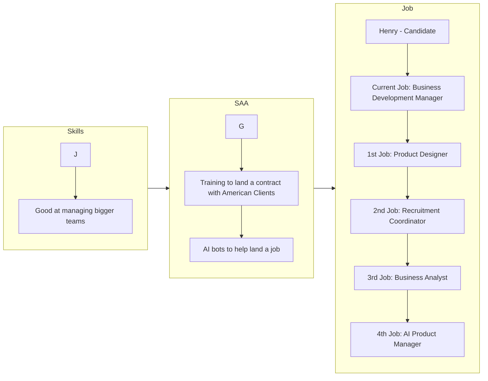

```mermaid
flowchart LR
subgraph Job
A[Henry - Candidate] --> B[Current Job: Business Development Manager]
B --> C[1st Job: Product Designer]
C --> D[2nd Job: Recruitment Coordinator]
D --> E[3rd Job: Business Analyst]
E --> F[4th Job: AI Product Manager]
end
subgraph SAA
G --> H[Training to land a contract with American Clients]
H --> I[AI bots to help land a job]
end
subgraph Skills
J --> K[Good at managing bigger teams]
end
Skills --> SAA --> Job
```

```mermaid
graph TD;
  A[Planet A] -->|Competitor 1| B[Planet B];
  A[Planet A] -->|Competitor 2| C[Planet C];
  A[Planet A] -->|Competitor 3| D[Planet D];
